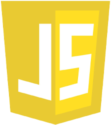

# Hi there 

My name is Rodion (or just Ro), and I'm a beginner frontend developer.

- 👨🏻‍🎓 Yandex.Practicum student
- 👨🏻‍🍼 Help junior students of "Yandex.Practicum" as a senior student
- 🤝 Ready to collaborate with experienced colleagues
- ✍🏻 Aimed at beautifull and clean code writing
- 💬 Ask me about 
- 📫 How to reach me: 
- ⚡ Fun fact: The moon has moonquakes.
 

 

<!--  -->

<!--
**RoChernikov/RoChernikov** is a ✨ _special_ ✨ repository because its `README.md` (this file) appears on your GitHub profile.

Here are some ideas to get you started:

- 🔭 I’m currently working on ...
- 🌱 I’m currently learning ...
- 👯 I’m looking to collaborate on ...
- 🤔 I’m looking for help with ...
- 💬 Ask me about ...
- 📫 How to reach me: ...
- 😄 Pronouns: ...
- ⚡ Fun fact: ...
-->
