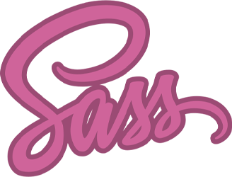

### Hi there 👋

My name is Rodion (or simply Ro), and I'm a beginner frontend developer.

- 🌱 I’m currently learning object-oriented JavaScript, prototype chain
- 🧩 More frameworks to the framework god
- 🤝 I want to collaborate with experienced colleagues
- ✍🏻 I strive to write beautiful and clean code
- 💬 Ask me about 
- 📫 How to reach me: http://t.me/ro_runner
- ⚡ Fun fact: The moon has moonquakes.
 
 

<!--
**RoChernikov/RoChernikov** is a ✨ _special_ ✨ repository because its `README.md` (this file) appears on your GitHub profile.

Here are some ideas to get you started:

- 🔭 I’m currently working on ...
- 🌱 I’m currently learning ...
- 👯 I’m looking to collaborate on ...
- 🤔 I’m looking for help with ...
- 💬 Ask me about ...
- 📫 How to reach me: ...
- 😄 Pronouns: ...
- ⚡ Fun fact: ...
-->
